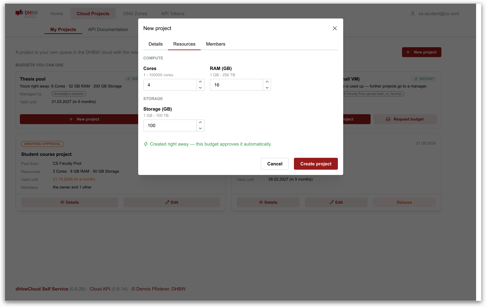
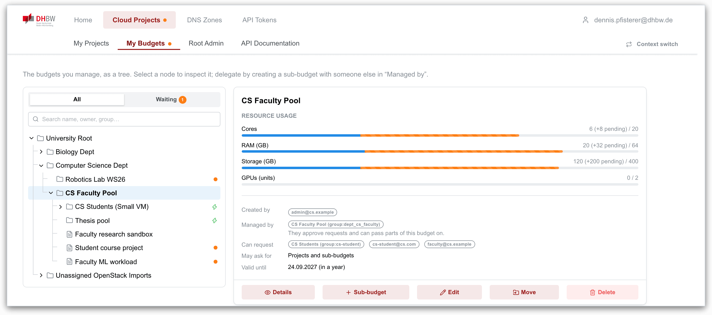
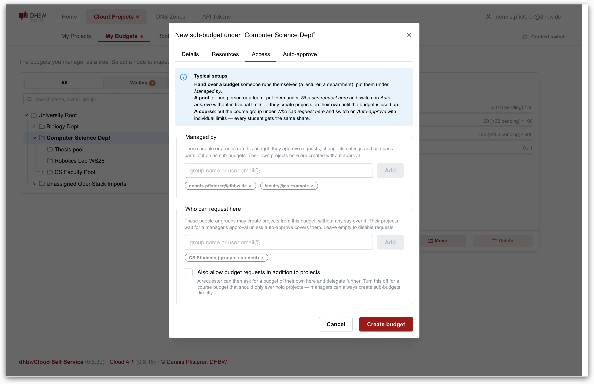
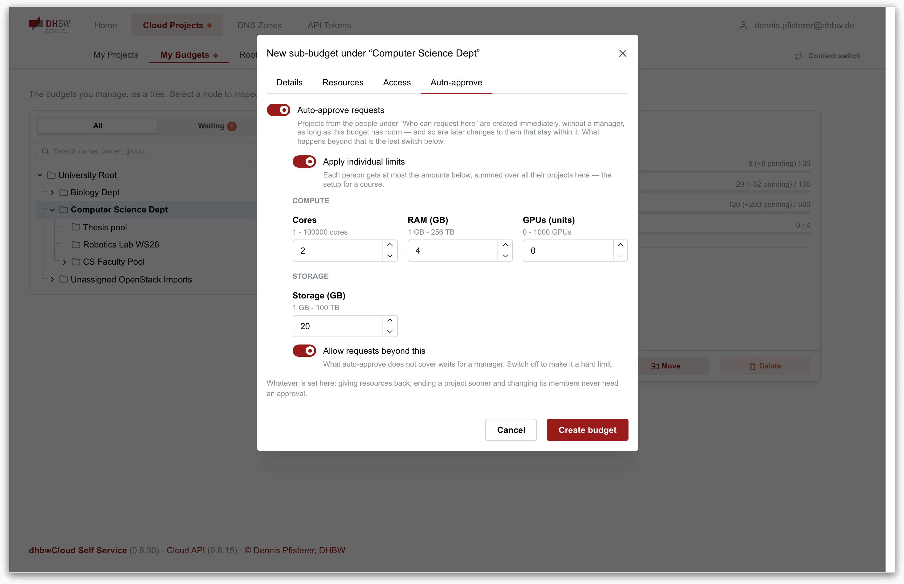

# dhbwCloud Self Service

## Why

Getting a virtual machine or a DNS name at a university usually means writing an
email and waiting. Someone with administrative rights reads it, decides, clicks it
together by hand, and answers — if they have time.

Where a default allocation exists at all, it rarely matches what the work actually
needs: too small for a course with 24 students, far too large for a one-afternoon
demo, and never the right storage. So almost every real request leaves the default
behind — and lands in a ticket queue, which means waiting again, this time for
someone who has to understand the request before they can size it.

The deeper problem is that the deciding happens centrally. A handful of people in
the data centre approve capacity for an entire university, although the person who
knows whether a request is reasonable is usually the lecturer who set the
assignment, not an administrator reading a ticket. Central allocation is not a
policy anyone chose; it is what happens when the platform has no way to hand
authority over resources to someone else.

This platform gives it that way. Capacity is handed out as **delegated pools**: a department gets a share it may pass on, a lecturer carves out a slice for a course and decides on requests against it, without asking the data centre. And for the common small case, nobody needs to decide at all — a pool can **approve requests on its own** — up to the whole budget, or up to a fixed share per person — so they are granted immediately and only what exceeds that reaches a human.

This is the web interface for that: people request what they need, whoever owns the
budget decides — or the policy decides for them — and both sides can see the state
and its history at any time.

## What it does

Two areas and the credentials for both, behind one login:

**Cloud Projects** — resources are handed out along a *budget tree*. A budget is a delegated pool of capacity; passing capacity on means creating a sub-budget with someone else as its manager. A project is a leaf: a concrete allocation with one owner, which the platform turns into a real OpenStack project. Requests, the approval of them, adjusted approvals, changes, moves, owner transfers and release all live here, and each node keeps its own history; every project status explains itself on hover, because "Released" asks for deletion rather than performing it.

A budget with auto-approval grants requests on the spot — as a pool until the budget is used up, or with individual limits per person — and later changes to a project that stay within it take effect at once too; giving resources back, ending sooner and changing members never wait. A budget can also refuse whatever its auto-approve does not cover, so nothing waits for a manager and its share becomes a hard limit. While a form is filled in it says what the button will do: create the project right away, or send it to the budget's managers, who are named. The budgets someone may draw from appear as cards on *My Projects*, each saying how much is theirs right away; *My Budgets* is shown only to people who manage a budget. The request dialogs show how much of the funding budget is still free and what share the entered values take. Resources are either quantities or *availabilities*, which are only granted or withheld and therefore get a switch instead of a number; each form offers only what the budget above it was delegated. Managers can adopt OpenStack projects that exist outside the managed lifecycle. Root admins see the state of the OpenStack reconciliation, and where the API permits it, a role switch shows the section as a given group or person would see it.

**DNS Zones** — self-service DNS. Users create zones they are entitled to by policy, edit records in the browser, and get per-zone TSIG keys so that Kubernetes, `external-dns` or `cert-manager` can keep the records up to date via RFC 2136 without a human in the loop. A zone the platform reports a problem with — a client failing TSIG in a loop, for example — carries a warning in the zone list and a banner on its page. Whoever a policy rule applies to also gets an *Administration* page with the rules and the zones delegated to them; super admins additionally see delegations, orphaned zones and every active zone event, with a pre-filled mail to the zone's owners.

**API Tokens** — one place for every credential a script, a CI job or an AI assistant uses, with a tab per issuing API (both APIs issue their own, and a credential has to be findable in one place to be revocable in a hurry). A token carries a note, a lifetime of choice (including none) and optionally read-only access, and the list shows when it was last used, which is what makes revoking one safe. Where the deployment configures an API's MCP endpoint, the tab also shows that address and a ready-made MCP server entry to paste into an existing client configuration.

Both areas also include the interactive API documentation of the service behind them.

**Language** — English and German, switched in the header and remembered in the browser (no account setting, nothing for a deployment to configure). The first visit follows the browser's language. Dates, relative times and the calendar follow the choice: 31.03.2027 in German, 31 Mar 2027 in English. The translation is being moved area by area; anything not translated yet stays English.

## Screenshots

### Cloud Projects

**My Projects** — the budgets a person may draw from, each saying how much is theirs right away and whether a project there needs an approval, and below them their own projects: what they cost, which budget pays for them, and what a pending change would do.


**Requesting a project** — the budget to pay from comes first. While the form is filled in, it says what the button will do: create the project right away, or send it to the budget's managers. Where a budget grants a fixed share per person on its own, the form starts filled with exactly what goes through instantly.



**My Budgets** — the tree resources are paid from, shown to people who manage a budget. Selecting a node shows its usage, who manages it, and who may request from it; budgets they may only request from appear read-only, marked with an eye.



**Delegating** — passing capacity on means creating a sub-budget with someone else under *Managed by*; *Who can request here* decides who may ask it for projects.



**Approving a request** — the manager sees what it would do to the funding budget before deciding, and can grant a smaller amount instead of rejecting.


**Approving without a manager** — with auto-approve on, requests go through as long as the budget has room; with individual limits, each person gets a fixed share, the setup for a course.



**Requesting a budget** — each amount shows how much the source budget still has free and what share of it the request would take.


**Root Admin** — state of the OpenStack reconciliation, and the shell query for projects past their termination date.


### DNS Zones

**Zone Management** — everything policy entitles this user to. A zone that has not been created yet offers *Activate*; an existing one can be opened, shared or extended by a subzone.


**Subzones** — where a rule permits it, a zone can be split further. The subzone becomes a delegated zone of its own, with its own key, and appears indented under its parent.


**Records** — the records of an active zone, edited inline. Changes go straight into the authoritative nameserver.


**Keys** — the TSIG keys of this zone: shared secrets that authenticate changes to it, and to nothing else. They can be rotated, which reissues them for every owner.


**Dynamic DNS** — ready-made `nsupdate` and `ddclient` configuration for keeping a host's address current, pre-filled with this zone's nameserver and key.


**TLS certificates** — the same key issues certificates over DNS-01, wildcards included. The page hands out working snippets for certbot, acme.sh and cert-manager.


<sub>Screenshots are taken against the development stack with example data. Key material shown in the DNS tabs is redacted, and the reconciliation figures on the Root Admin page are an example, since the development stack has no OpenStack behind it.</sub>

## How it fits together

This is a static single-page application. It holds no business logic and no
database of its own: every rule about who may request, approve or delegate
anything lives in the two APIs behind it, and this app renders their answers.

```
      browser
         │  (1) HTML/JS, config.js and /api/..., all same-origin
         ▼
   ┌───────────────┐
   │ oauth2-proxy  │  (2) injects the Bearer server-side
   │  (BFF)        │
   └───────┬───────┘
           ▼
   ┌──────────────────┐
   │ this app (Caddy) │  serves the static files,
   │                  │  forwards /api/* in-cluster
   └───────┬──────────┘
           │
           ├──────────────▶ openstack-management-api ──▶ OpenStack
           │                 budgets, projects,          (Keystone, Nova,
           │                 approvals, reconciler        Cinder, Neutron)
           │                        │
           │                        └──▶ role-provider-service
           │                              group membership
           │
           └──────────────▶ dynamic-zones-api ────────▶ PowerDNS
                             zones, records, policy      (authoritative DNS)
```

- **[openstack-management-api](https://github.com/pfisterer/openstack-management-api)**
  owns the budget tree and the project lifecycle. Everything under *Cloud
  Projects* is its state: which budgets you manage, what a request would cost the
  funding budget, who may approve it — and it is what turns an approved project
  into a real OpenStack project.
- **[dynamic-zones](https://github.com/pfisterer/dynamic-zones)** owns zones,
  records, TSIG keys and DNS policy. Everything under *DNS Zones* is its state.
- **[role-provider-service](https://github.com/pfisterer/role-provider-service)** answers which groups a person belongs to. This app never calls it directly — it reaches it through the projects API, which is where group search in the "Managed by" and "Who can request here" fields comes from.

Whether the *Cloud Projects* section exists at all depends on configuration: with no `CLOUD_RESOURCES_BASE_URL` set, the section and its routes are not registered, and the app is a pure DNS self-service. Which sections exist is decided in one place, [`web/features.js`](web/features.js), from the configured URLs rather than from failed requests — a restarting backend must not look like a section that was never installed. *API Tokens* offers a tab only for an API that is configured, and the MCP details only where an MCP URL is set.

Two consequences of this split are worth knowing before changing anything:

- **No token lives in the browser.** In production an `oauth2-proxy` sits in
  front of the app (Backend-for-Frontend): it authenticates the user, keeps the
  session in a cookie and injects the bearer token into API calls server-side.
  The app reads the user's identity from `/oauth2/userinfo`, nothing more. A
  `401` from an API therefore means "the proxy session expired", and the app says
  so instead of navigating away silently.
- **The API clients are build-time dependencies.** Both APIs publish their
  generated TypeScript SDK to npm (`@dhbw-cloud/dynamic-zones-client`,
  `@dhbw-cloud/os-mgt-client`) and this app depends on a version. They used to be
  fetched from the APIs at startup, which meant a missing operation showed up as a
  silent no-op in the browser; now it fails the build here.

The navigation is data, defined once in [`web/nav.jsx`](web/nav.jsx): which
sections exist, which entries a given user gets, which of them the URL is in. The
header renders it twice (two bars on a wide screen, one list in the burger) and
the shell derives its height from it. Entries with nothing behind them for the
current user are left out rather than shown leading to an empty page.

Server state lives in a query cache (TanStack Query), never in `useState` — see
the reasoning in [`web/providers/query.jsx`](web/providers/query.jsx).

## Running it locally

**Prerequisites:** Node.js 22+ (the render tests' jsdom needs it), npm. For anything beyond the shell of the app you also need the two APIs; the deployment repo ships a script that starts all of them together (`run-development.sh`).

```bash
npm install
npm run dev        # Vite dev server on http://localhost:8084
```

Configuration comes from `.env` (and `.env.local`, which takes precedence — mind
that when ports do not match what your APIs actually serve):

```ini
DYNAMIC_ZONE_BASE_URL=http://localhost:8082/
CLOUD_RESOURCES_BASE_URL=http://localhost:8083/
DUMMY_AUTH=true
OIDC_CLIENT_ID=dev
OIDC_ISSUER_URL=https://sso.example/realms/x
# optional
CLOUD_RESOURCES_MCP_URL=
DYNAMIC_ZONE_MCP_URL=
ACME_SERVER=
```

Mind the naming: the dev server reads `DYNAMIC_ZONE_*`, the container reads `DYN_ZONES_*` (see [Deployment](#deployment)); every other variable has the same name in both.

`DUMMY_AUTH=true` **plus a dev build** enables the dev login, where you sign in
as any address (`?dev_user=<email>` works too) and the APIs accept that identity
via an `X-Dummy-Auth-User` header. It is compiled out of every `vite build`
artifact — `import.meta.env.DEV` is false there, so no runtime configuration can
re-enable the bypass in a staging or production image.

Vite writes `web/config.js` from those variables on start; in a container the
same file is generated by [`docker-entrypoint.sh`](docker-entrypoint.sh).

```bash
npm run build       # production bundle into dist/
npm run check       # ESLint + all tests — what CI runs (also: make check)
npm test            # tests only
make docker-build   # container image
make bump V=x.y.z   # runs the checks, then sets the version in package.json and Chart.yaml
```

There are two kinds of tests. `*.test.js` cover the pure functions — the arithmetic and string rules that go wrong silently — and run in Node without a DOM. `*.test.jsx` render the main views in jsdom and exist because views that could not render at all have shipped with lint, tests and build all green. CI runs these checks in a workflow of their own; nothing is verified inside the image build.

`package.json` is the single source of truth for the version, and `helm-chart/Chart.yaml` has to agree with it: CI fails on a mismatch rather than fixing it up. `make bump` keeps both in step (it needs `jq` and `helm`).

## Deployment

**Normally deployed as part of [cloud-self-service](https://github.com/pfisterer/cloud-self-service)**, the umbrella chart that composes this service with the other three and pins it by version — and a pinned chart version pins its `appVersion`, which pins the image tag. Installing this chart on its own works, but then nothing keeps it in step with the services it talks to.

The image serves `dist/` through Caddy and generates `config.js` at container
start, so one image works in every environment. Required and optional variables:

| Variable | Required | Meaning |
|---|---|---|
| `DYN_ZONES_BASE_URL` | yes | Base URL of dynamic-zones-api, with trailing slash |
| `CLOUD_RESOURCES_BASE_URL` | no | Base URL of openstack-management-api; empty hides the Cloud Projects section entirely |
| `DYN_ZONES_MCP_URL`, `CLOUD_RESOURCES_MCP_URL` | no | Where an MCP client reaches each API, shown on the API Tokens page; empty shows nothing about MCP for that API. Deliberately not derived from the base URLs: those may be BFF paths, which answer a bearer token with a login redirect |
| `OIDC_CLIENT_ID`, `OIDC_ISSUER_URL` | yes | The login itself is done by the proxy in front; the app uses these for sign-out, sending the browser on to the issuer's logout endpoint (Keycloak's `/protocol/openid-connect/logout` path) with this client ID |
| `ACME_SERVER` | no | ACME endpoint advertised in the certificate instructions |
| `DUMMY_AUTH` | no | Ignored by production builds (see above) |
| `DYN_ZONES_UPSTREAM`, `CLOUD_RESOURCES_UPSTREAM` | no | In-cluster `host:port` Caddy forwards `/api/dyndns/` and `/api/projects/` to. These are Service names owned by *other* releases; leaving them to the image defaults is how a rename over there once turned every DNS Zones call into a 502 |

In BFF mode the app must be reached **through** the proxy, and `/oauth2/*` must be routed to it — the app calls `/oauth2/userinfo` for the identity, `/oauth2/auth` to notice an expired session, `/oauth2/start` to begin a new one, and `/oauth2/sign_out` to end it.

A Helm chart lives in [`helm-chart/`](helm-chart) (`selfServiceUI`, `auth`, `ingress`, `bff`), with a `values.schema.json` that rejects unknown keys. Images are published to `ghcr.io/pfisterer/self-service-ui`; `-test.N` tags are the staging channel, plain semver is production. A version that is already in the registry is never pushed again, so a commit without a version bump cannot change what a running tag contains, and only stable versions get a Git tag and a GitHub release.

**The proxy is part of this chart.** `bff.enabled` deploys an `oauth2-proxy` in
front of the app, with the ingress pointing at it rather than at the app — so
`ingress.enabled` belongs off in that mode, or there would be a second,
unauthenticated route to the same content. It sits here rather than one level up
for one reason: its upstream *is* this chart's Service, and deriving that name
beats writing it out and watching it go stale. Off by default, because an
environment that already runs its own proxy would otherwise end up with two
owners of the same host.

The proxy reads its client ID, client secret and cookie secret from an existing Secret (`bff.existingSecret`, keys `client-id`, `client-secret`, `cookie-secret`); keeping the cookie secret stable across redeploys is what keeps sessions alive. `bff.cookieExpire` (default `8h`) bounds a session, because the oauth2-proxy default is a week and the offline refresh token it holds is not tied to the single sign-on session, so a logout elsewhere does not reach it. For sign-out to reach the issuer, its host belongs in `bff.whitelistDomains`.

The chart is published as an OCI artifact for every new version pushed to `main`, prereleases included:

```sh
helm pull oci://ghcr.io/pfisterer/charts/self-service-ui --version 0.8.26
```

Values for this chart go under its chart name in the umbrella:

```yaml
self-service-ui:
  selfServiceUI:
    ...
```

## Repository layout

```
web/
  index.jsx            app shell, providers, routes
  nav.jsx              the navigation as data (single source)
  features.js          which sections this deployment has (from config.js)
  header.jsx           both navigation levels + account column
  providers/           auth, session, API clients, query cache, modals
  projects/            Cloud Projects: budget tree, cards, dialogs, role switch, API facade
  dyndns/              DNS Zones: zones, records, keys, administration, zone events
  tokens/              API Tokens: one tab per issuing API, MCP config snippets
  swagger/             interactive API documentation for both APIs
  helper/              validation, error formatting, code blocks
  test/                render harness for the *.test.jsx view tests
docs/img/              screenshots used in this README
helm-chart/            deployment chart
Caddyfile              static serving + /api/* forwarding
docker-entrypoint.sh   writes config.js at container start
```

## Related projects

- [cloud-self-service](https://github.com/pfisterer/cloud-self-service) — the umbrella chart that composes all four
- [dynamic-zones](https://github.com/pfisterer/dynamic-zones) — the DNS self-service API behind the DNS Zones section
- [openstack-management-api](https://github.com/pfisterer/openstack-management-api) — the projects and quotas API behind Cloud Projects
- [role-provider-service](https://github.com/pfisterer/role-provider-service) — groups and authorization, consumed by openstack-management-api

## License

See [LICENSE](./LICENSE).
