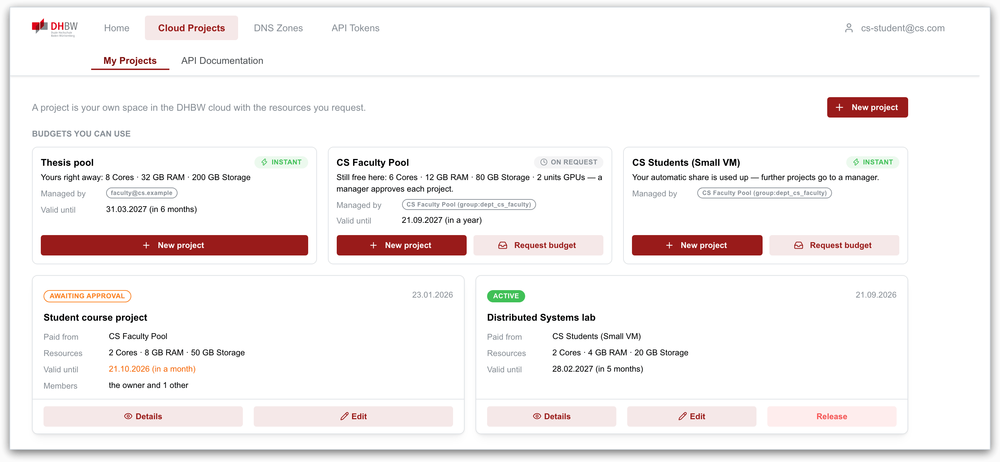
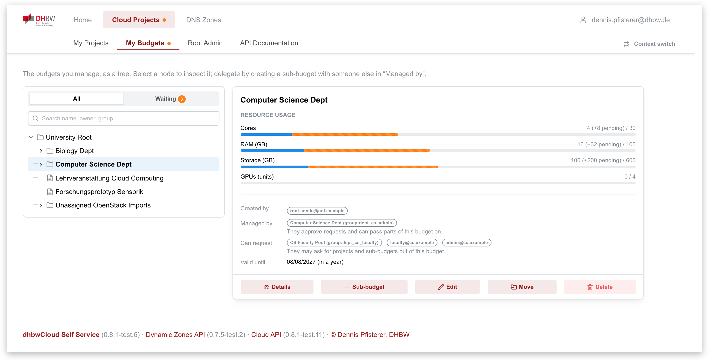
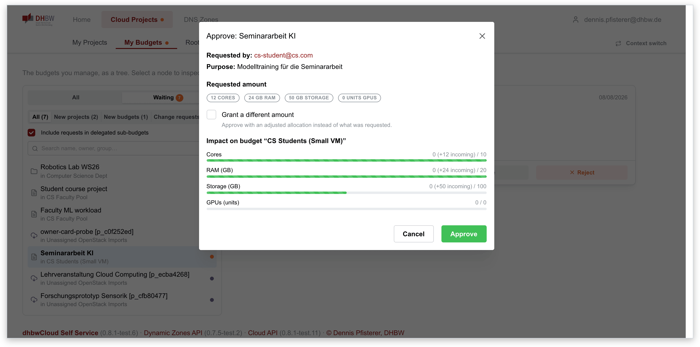
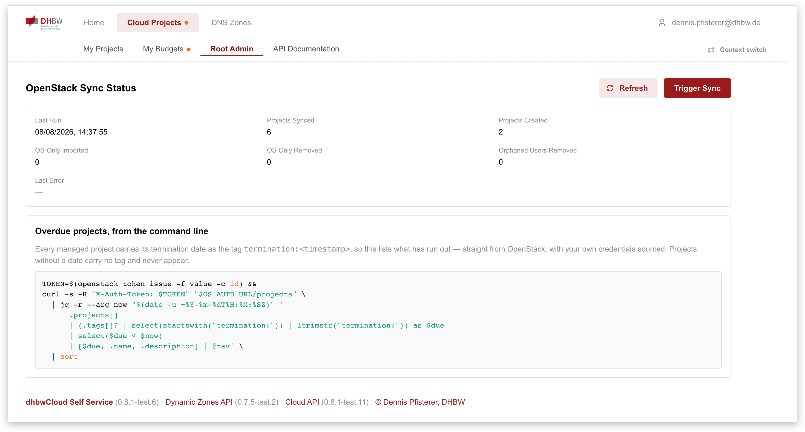
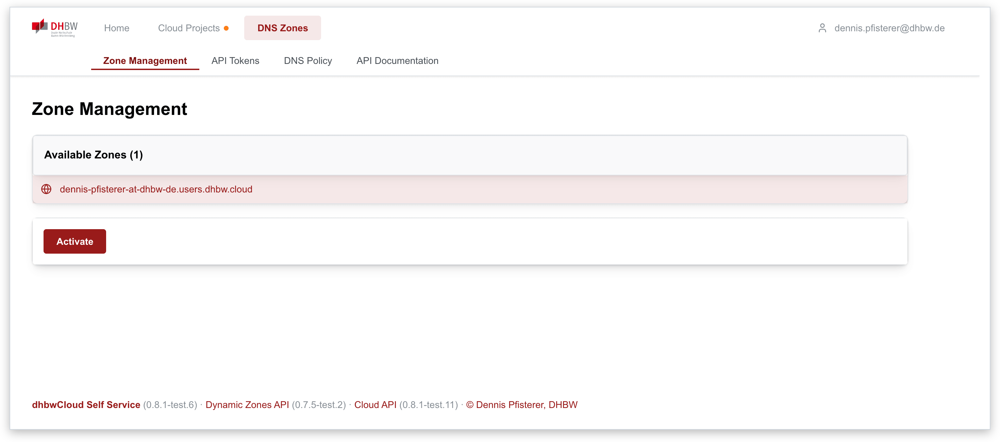
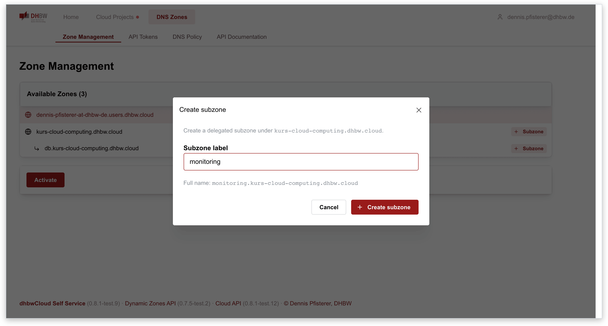
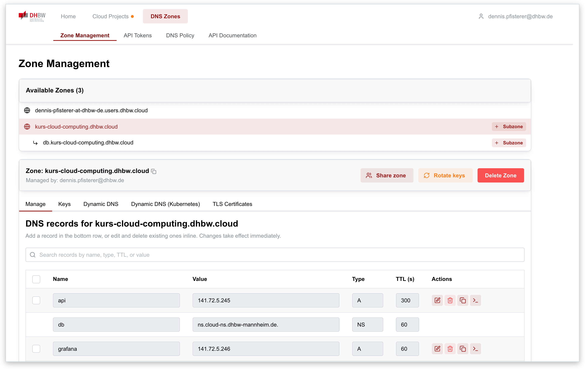
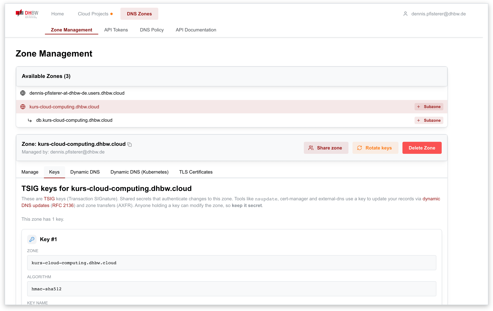
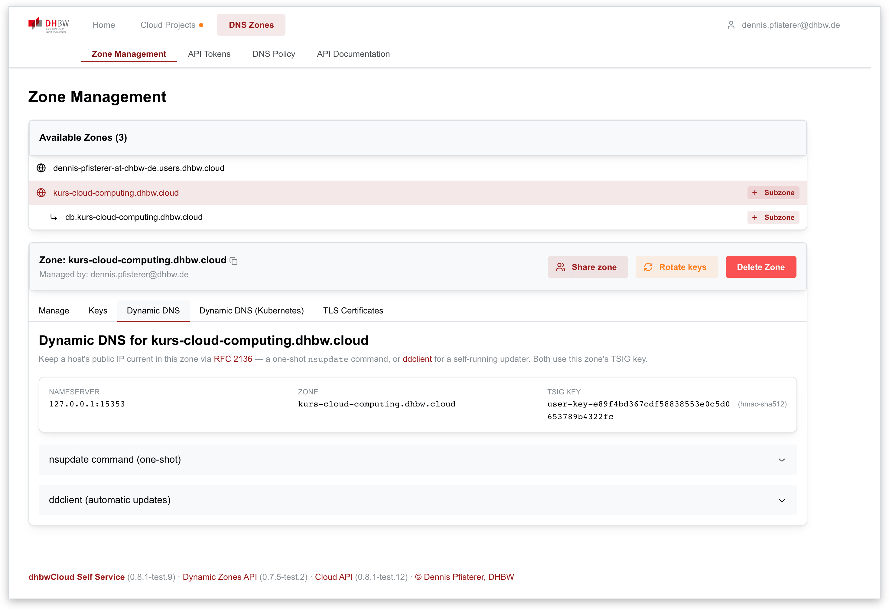
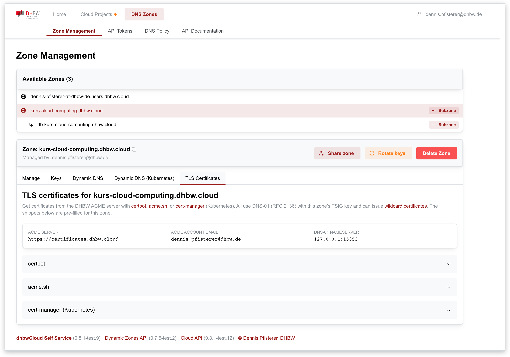

# dhbwCloud Self Service

## Why

Getting a virtual machine or a DNS name at a university usually means writing an
email and waiting. Someone with administrative rights reads it, decides, clicks it
together by hand, and answers — if they have time.

Where a default allocation exists at all, it rarely matches what the work actually
needs: too small for a course with 24 students, far too large for a one-afternoon
demo, and never the right storage. So almost every real request leaves the default
behind — and lands in a ticket queue, which means waiting again, this time for
someone who has to understand the request before they can size it.

The deeper problem is that the deciding happens centrally. A handful of people in
the data centre approve capacity for an entire university, although the person who
knows whether a request is reasonable is usually the lecturer who set the
assignment, not an administrator reading a ticket. Central allocation is not a
policy anyone chose; it is what happens when the platform has no way to hand
authority over resources to someone else.

This platform gives it that way. Capacity is handed out as **delegated pools**: a
department gets a share it may pass on, a lecturer carves out a slice for a course
and decides on requests against it, without asking the data centre. And for the
common small case, nobody needs to decide at all — a pool can carry an
**auto-approval** cap per person, so requests within it are granted immediately and
only what exceeds it reaches a human.

This is the web interface for that: people request what they need, whoever owns the
budget decides — or the policy decides for them — and both sides can see the state
and its history at any time.

## What it does

Two areas, one login:

**Cloud Projects** — resources are handed out along a *budget tree*. A budget is
a delegated pool of capacity; passing capacity on means creating a sub-budget
with someone else as its manager. A project is a leaf: a concrete allocation with
one owner, which the platform turns into a real OpenStack project. Requests, the
approval of them, adjusted approvals, changes and release all live here, and each
node keeps its own history.

**DNS Zones** — self-service DNS. Users create zones they are entitled to by
policy, edit records in the browser, and get per-zone TSIG keys plus API tokens
so that Kubernetes, `external-dns` or `cert-manager` can keep the records up to
date via RFC 2136 without a human in the loop.

## Screenshots

### Cloud Projects

**My Projects** — a person's own projects: what they cost, and what can be done
with them.



**My Budgets** — the tree resources are paid from. Selecting a node shows its
usage, who manages it, and who may request from it.



**Approving a request** — the manager sees what it would do to the funding budget
before deciding, and can grant a smaller amount instead of rejecting.



**Root Admin** — state of the OpenStack reconciliation, and the shell query for
projects past their termination date.



### DNS Zones

**Zone Management** — everything policy entitles this user to. A zone that has
not been created yet offers *Activate*; an existing one can be opened, shared or
extended by a subzone.



**Subzones** — where a rule permits it, a zone can be split further. The subzone
becomes a delegated zone of its own, with its own key, and appears indented under
its parent.



**Records** — the records of an active zone, edited inline. Changes go straight
into the authoritative nameserver.



**Keys** — the TSIG keys of this zone: shared secrets that authenticate changes to
it, and to nothing else. They can be rotated, which reissues them for every owner.



**Dynamic DNS** — ready-made `nsupdate` and `ddclient` configuration for keeping a
host's address current, pre-filled with this zone's nameserver and key.



**TLS certificates** — the same key issues certificates over DNS-01, wildcards
included. The page hands out working snippets for certbot, acme.sh and
cert-manager.



<sub>Screenshots are taken against the development stack with example data. Key
material shown in the DNS tabs is redacted.</sub>

## How it fits together

This is a static single-page application. It holds no business logic and no
database of its own: every rule about who may request, approve or delegate
anything lives in the two APIs behind it, and this app renders their answers.

```
      browser
         │  (1) HTML/JS, config.js
         ▼
   ┌───────────────┐        ┌──────────────────────────┐
   │ oauth2-proxy  │──────▶ │ this app (Caddy, static) │
   │  (BFF)        │        └──────────────────────────┘
   └───────┬───────┘
           │  (2) /api/... with a server-side injected Bearer
           │
           ├──────────────▶ openstack-management-api ──▶ OpenStack
           │                 budgets, projects,          (Keystone, Nova,
           │                 approvals, reconciler        Cinder, Neutron)
           │                        │
           │                        └──▶ role-provider-service
           │                              group membership
           │
           └──────────────▶ dynamic-zones-api ────────▶ PowerDNS
                             zones, records, policy      (authoritative DNS)
```

- **[openstack-management-api](https://github.com/pfisterer/openstack-management-api)**
  owns the budget tree and the project lifecycle. Everything under *Cloud
  Projects* is its state: which budgets you manage, what a request would cost the
  funding budget, who may approve it — and it is what turns an approved project
  into a real OpenStack project.
- **[dynamic-zones](https://github.com/pfisterer/dynamic-zones)** owns zones,
  records, TSIG keys and DNS policy. Everything under *DNS Zones* is its state.
- **[role-provider-service](https://github.com/pfisterer/role-provider-service)**
  answers which groups a person belongs to. This app never calls it directly — it
  reaches it through the projects API, which is where group search in the
  "managed by" and "can request" fields comes from.

Whether the *Cloud Projects* section exists at all depends on configuration: with
no `CLOUD_RESOURCES_BASE_URL` set, the section and its routes are not registered,
and the app is a pure DNS self-service.

Two consequences of this split are worth knowing before changing anything:

- **No token lives in the browser.** In production an `oauth2-proxy` sits in
  front of the app (Backend-for-Frontend): it authenticates the user, keeps the
  session in a cookie and injects the bearer token into API calls server-side.
  The app reads the user's identity from `/oauth2/userinfo`, nothing more. A
  `401` from an API therefore means "the proxy session expired", and the app says
  so instead of navigating away silently.
- **The API clients are build-time dependencies.** Both APIs publish their
  generated TypeScript SDK to npm (`@dhbw-cloud/dynamic-zones-client`,
  `@dhbw-cloud/os-mgt-client`) and this app depends on a version. They used to be
  fetched from the APIs at startup, which meant a missing operation showed up as a
  silent no-op in the browser; now it fails the build here.

The navigation is data, defined once in [`web/nav.jsx`](web/nav.jsx): which
sections exist, which entries a given user gets, which of them the URL is in. The
header renders it twice (two bars on a wide screen, one list in the burger) and
the shell derives its height from it. Entries with nothing behind them for the
current user are left out rather than shown leading to an empty page.

Server state lives in a query cache (TanStack Query), never in `useState` — see
the reasoning in [`web/providers/query.jsx`](web/providers/query.jsx).

## Running it locally

**Prerequisites:** Node.js 20+, npm. For anything beyond the shell of the app you
also need the two APIs; the deployment repo ships a script that starts all of
them together (`run-development.sh`).

```bash
npm install
npm run dev        # Vite dev server on http://localhost:8084
```

Configuration comes from `.env` (and `.env.local`, which takes precedence — mind
that when ports do not match what your APIs actually serve):

```ini
DYNAMIC_ZONE_BASE_URL=http://localhost:8082/
CLOUD_RESOURCES_BASE_URL=http://localhost:8083/
DUMMY_AUTH=true
OIDC_CLIENT_ID=dev
OIDC_ISSUER_URL=https://sso.example/realms/x
```

`DUMMY_AUTH=true` **plus a dev build** enables the dev login, where you sign in
as any address (`?dev_user=<email>` works too) and the APIs accept that identity
via an `X-Dummy-Auth-User` header. It is compiled out of every `vite build`
artifact — `import.meta.env.DEV` is false there, so no runtime configuration can
re-enable the bypass in a staging or production image.

Vite writes `web/config.js` from those variables on start; in a container the
same file is generated by [`docker-entrypoint.sh`](docker-entrypoint.sh).

```bash
npm run build       # production bundle into dist/
npx eslint web/     # lint (no test suite yet — see d5 in the TODOs)
make docker-build   # container image
```

## Deployment

The image serves `dist/` through Caddy and generates `config.js` at container
start, so one image works in every environment. Required and optional variables:

| Variable | Required | Meaning |
|---|---|---|
| `DYN_ZONES_BASE_URL` | yes | Base URL of dynamic-zones-api, with trailing slash |
| `CLOUD_RESOURCES_BASE_URL` | no | Base URL of openstack-management-api; empty hides the Cloud Projects section entirely |
| `OIDC_CLIENT_ID`, `OIDC_ISSUER_URL` | yes | Shown to the app; the actual login is done by the proxy in front |
| `ACME_SERVER` | no | ACME endpoint advertised in the certificate instructions |
| `DUMMY_AUTH` | no | Ignored by production builds (see above) |
| `DYN_ZONES_UPSTREAM`, `CLOUD_RESOURCES_UPSTREAM` | no | In-cluster `host:port` Caddy forwards `/api/dyndns/` and `/api/projects/` to. These are Service names owned by *other* releases; leaving them to the image defaults is how a rename over there once turned every DNS Zones call into a 502 |

In BFF mode the app must be reached **through** the proxy, and `/oauth2/*` must
be routed to it — the app calls `/oauth2/userinfo` for the identity,
`/oauth2/auth` to notice an expired session, and `/oauth2/start` to begin a new
one.

A Helm chart lives in [`helm-chart/`](helm-chart) (`selfServiceUI`, `auth`,
`ingress`, `bff`). Images are published to `ghcr.io/pfisterer/self-service-ui`;
`-test.N` tags are the staging channel, plain semver is production.

**The proxy is part of this chart.** `bff.enabled` deploys an `oauth2-proxy` in
front of the app, with the ingress pointing at it rather than at the app — so
`ingress.enabled` belongs off in that mode, or there would be a second,
unauthenticated route to the same content. It sits here rather than one level up
for one reason: its upstream *is* this chart's Service, and deriving that name
beats writing it out and watching it go stale. Off by default, because an
environment that already runs its own proxy would otherwise end up with two
owners of the same host.

The chart is published as an OCI artifact on every push to `main`:

```sh
helm pull oci://ghcr.io/pfisterer/charts/self-service-ui --version 0.8.7-test.1
```

It is normally not installed on its own. The DHBW deployment composes all four
services with the [cloud-self-service](https://github.com/pfisterer/cloud-self-service)
umbrella chart, which pins this chart by version — and a pinned chart version
pins its `appVersion`, which pins the image tag. Values for this chart go under
its chart name there:

```yaml
self-service-ui:
  selfServiceUI:
    ...
```

## Repository layout

```
web/
  index.jsx            app shell, providers, routes
  nav.jsx              the navigation as data (single source)
  header.jsx           both navigation levels + account column
  providers/           auth, session, API clients, query cache, modals
  projects/            Cloud Projects: budget tree, cards, dialogs, API facade
  dyndns/              DNS Zones: zones, records, tokens, policy
  helper/              validation, error formatting, code blocks
docs/img/              screenshots used in this README
helm-chart/            deployment chart
```

## Related projects

- [cloud-self-service](https://github.com/pfisterer/cloud-self-service) — the umbrella chart that composes all four
- [dynamic-zones](https://github.com/pfisterer/dynamic-zones) — the DNS self-service API behind the DNS Zones section
- [openstack-management-api](https://github.com/pfisterer/openstack-management-api) — the projects and quotas API behind Cloud Projects
- [role-provider-service](https://github.com/pfisterer/role-provider-service) — groups and authorization, consumed by both APIs

## License

See [LICENSE](./LICENSE).
